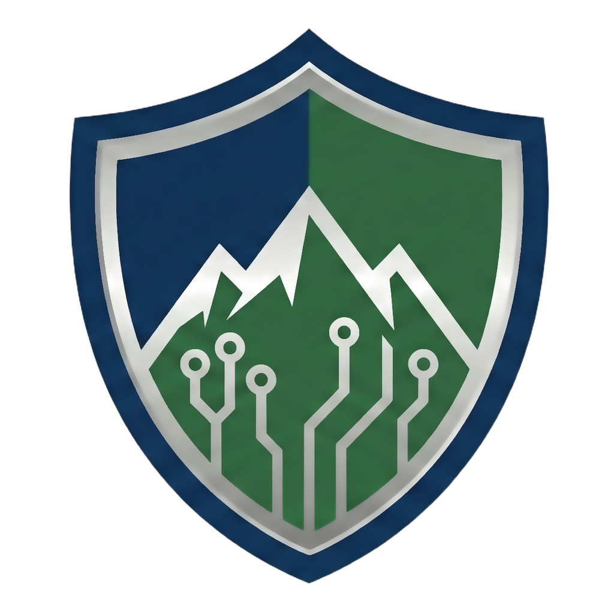

    
  <b>Secure remote support by Southern Colorado Systems, LLC</b>

# SoCo Systems Sentry — Shared Library (hbb_common)

This is the shared Rust library used by both halves of
[SoCo Systems Sentry](https://sentry.socosystems.net) — the branded remote-support
system operated by **Southern Colorado Systems, LLC**. It is a fork of
[rustdesk/hbb_common](https://github.com/rustdesk/hbb_common) (AGPL-3.0).

> [!IMPORTANT]
> **Do not delete this repository — it is load-bearing.** It is not browsed as a
> normal folder; it is pulled in as a build dependency by both Sentry repos:
> - **Client** ([`SoCoSys/soco-sentry`](https://github.com/SoCoSys/soco-sentry)) includes it as the `libs/hbb_common` **git submodule**, on the **`soco-brand`** branch — which carries the branded app name, relay hostname, and server public key baked into every client.
> - **Relay server** ([`SoCoSys/sentry-server`](https://github.com/SoCoSys/sentry-server)) clones it during its Docker image build, from the **`main`** branch (an upstream mirror).
>
> Deleting this repository, or either the `soco-brand` or `main` branch, breaks both builds.

> [!NOTE]
> **Authorized use only.** Published for source transparency and AGPL-3.0
> compliance; not a general-purpose product, and not open to external contributions.

## Branches

- **`soco-brand`** — branded configuration, used by the Sentry client.
- **`main`** — upstream mirror, used by the Sentry relay server build.

## License & attribution

Derivative work of [rustdesk/hbb_common](https://github.com/rustdesk/hbb_common),
distributed under the **GNU AGPL-3.0** license. RustDesk trademarks and copyrights
remain with their respective owners.
